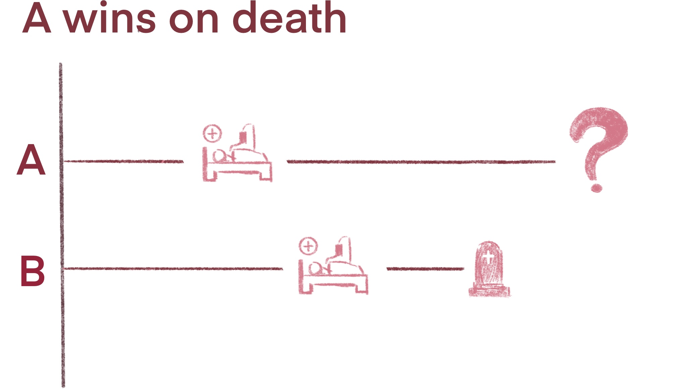
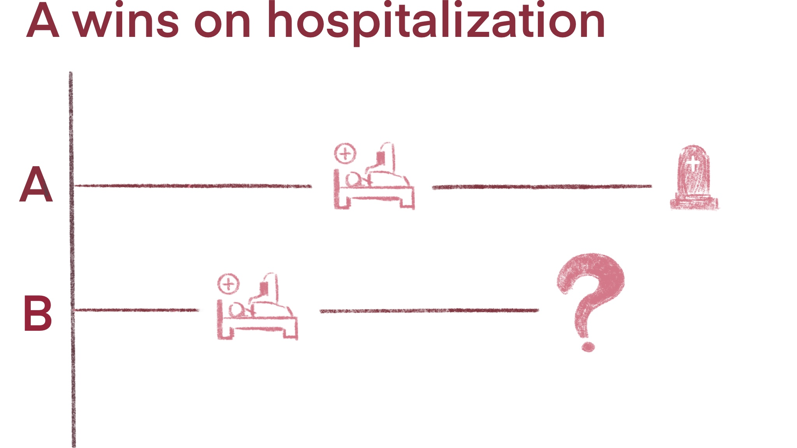
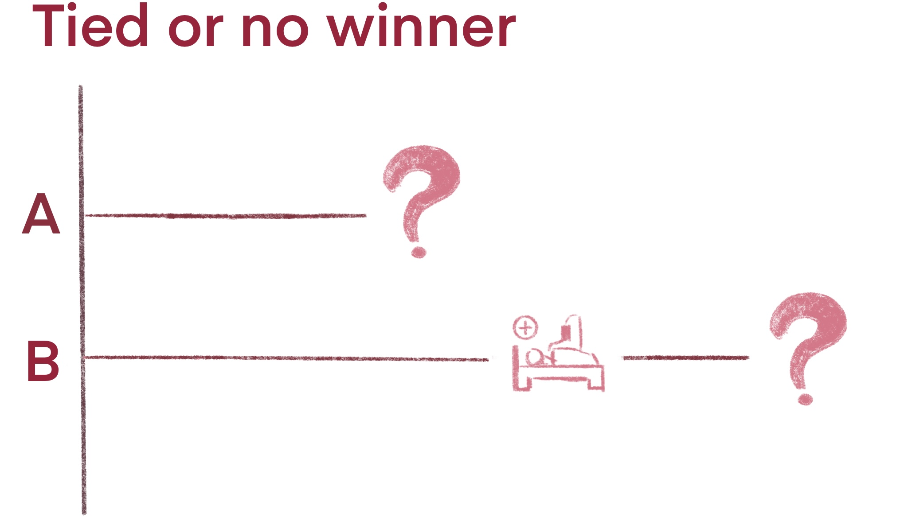
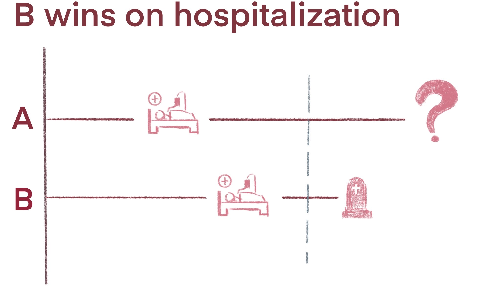
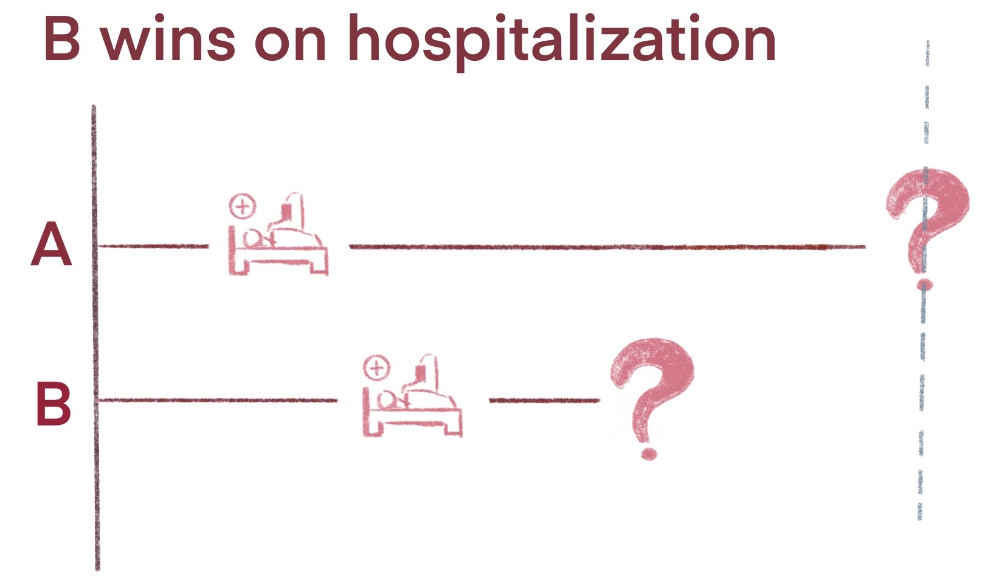
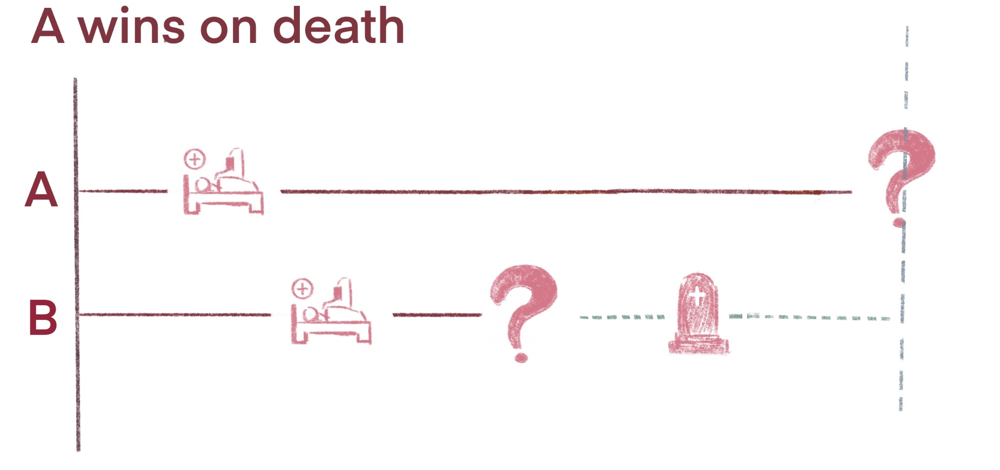
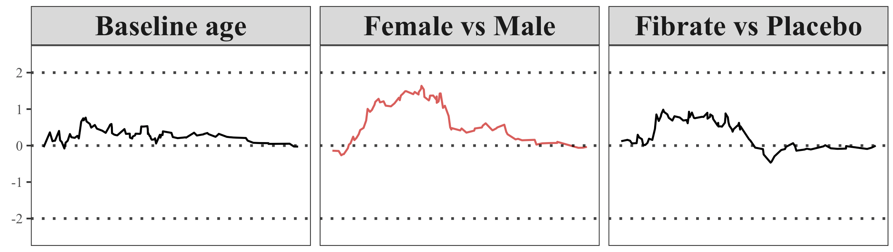

```{r setup, include=FALSE}
options(htmltools.dir.version = FALSE, htmltools.preserve.raw = FALSE)
```

```{r xaringan-extra, echo=FALSE}
xaringanExtra::use_tile_view()
xaringanExtra::use_panelset()
xaringanExtra::use_tachyons()
xaringanExtra::use_progress_bar(color = "#ea5455", location = "top", height = "10px")

xaringanExtra::style_panelset_tabs(
  active_foreground = "#0051BA",
  hover_foreground = "#d22")
```

---

# Composite Endpoints

--

#### Composite endpoints include two or more types of related clinical events 

--

- Common in cardiovascular (CV) clinical trials and cancer clinical trials
  
  - CV trials: death, heart failure, myocardial infarction, stroke, and hospitalization

- Increase number of events, increase statistical efficiency, reduce sample size

--

#### Traditional Methods on Composite Endpoints

--

- Focus on time to the first event (TFE)

- Ignore the hierarchical structure 

- Assume death and non-fatal events are equally important

---
class: inverse, center, middle

# Death  $>$ Hospitalization 

---
class: inverse, center, middle

## `r anicon::faa("arrow-circle-right", animate="passing", size=0.8)` Win ratio (Pocock et al. 2012)


---
# Win statistics

--

- .bold[General pairwise comparisons]: compare every patient in the treatment with every one in the control

--

- Within each pair

  - Decide a "win", a "lose" or a "tie"
  
  - First compare on the most important event: time to death 
  
  - If the comparison is inconclusive due to censoring, proceed to the second most important event

--


--

--


---
# Win statistics

--

Define

- $N_t$ and $N_c$: number of subjects in treatment and control group

- $n_t$ and $n_c$: number of wins by treatment and control group

--

- $P_t = \frac{n_t}{N_tN_c}$: proportions of pairs when treatment wins

- $P_c = \frac{n_c}{N_tN_c}$: proportions of pairs when control wins

- $P_{\text{tie}} = 1-P_t-P_c$: proportions of ties

--

The treatment effect can be quantified by a series of win statistics:

- net benefit </span><span style='font-size:13pt; color:#707070'> (Buyse, 2010) </span> : $P_t - P_c$

- **win ratio** </span><span style='font-size:13pt; color:#707070'> (Pocock, 2012) </span>: ${P_t}/{P_c}$

- win odds </span><span style='font-size:13pt; color:#707070'> (Dong, 2020) </span>: $(P_t + 0.5P_{\text{tie}})/(P_c + 0.5P_{\text{tie}})$

---
# Win Ratio <span style='font-size:18pt; color:black'> `r icons::fontawesome("arrow-circle-right")` </span> <span style='font-size:23pt; color:black'> Challenge </span>  

#### Challenge 1

- The true value (estimand) of win ratio depends on the censoring distribution and the maximum follow-up time

--

$\hspace{3cm}$
--



---
class: inverse, center, middle, hide-logo

<span style='font-size:25pt; color:#FFFFFF'> ICH E9 (R1): "...missing data and loss-to-follow-up are irrelevant to the construction of the estimand."  </span>

---
# Win Ratio <span style='font-size:18pt; color:black'> `r icons::fontawesome("arrow-circle-right")` </span> <span style='font-size:23pt; color:black'> Challenge </span>  

--

#### Challenge 2

- Previous work on win ratio focus on two-sample comparison

--

- **Regression framework vs. two-sample comparison:**

  - Covariate adjustment
  
  - Statistical efficiency 

  - Subgroup analysis 

  - Adjusting confounders (observational studies)


---
# Win Ratio <span style='font-size:18pt; color:black'> `r icons::fontawesome("arrow-circle-right")` </span>  <span style='font-size:23pt; color:black'> General Framework</span>

.bold[Notations]

- $D$: survival time and $N_D(t) = I(D\leq t)$ 

- $N_1(t),\ldots,N_K(t)$ denote the counting processes of $K$ non-fatal
events ordered by importance

- $\bar{N}(t) = \{N(u):0\leq u\leq t\}$ : event-history process

- $Y_1(t), \ldots, Y_J(t)$ : $J$ longitudinal variables measured at time $t$

- Covaraite history $\bar{Y}_j(t) = \{Y_j(u): 0 \leq u \leq t\}$ 

- $\boldsymbol{Y}(t) = \left\{ \bar{N}_D(t),\bar{N}_1(t),\ldots,\bar{N}_K(t), \bar{Y}_1(t), \ldots, \bar{Y}_J(t) \right\}$

- For all notations, we use subscripts $i$ and $j$ to denote the corresponding values from subjects $i$ and $j$

- $\tau$: maximum follow-up time or user specified time

???

First, let me introduce some necessary notations. Let D denote survival and N_D is the counting process of Death, which is an indication function. Let N1 to Nk represent the counting processes of K non-fatal events. Let N bar t represent the event history process. We also consider some longitudinal data as well. Let Yt be the set of all the event history processes. Note that for all these notations, we will use subscripts i and j to represent different subjects.

---
# Restricted Time Win Ratio <span style='font-size:18pt; color:black'> `r icons::fontawesome("arrow-circle-right")` </span> <span style='font-size:23pt; color:black'> Estimand </span>  

--

.bold[Win function]: Define the win indicator function for two independent subjects with
$\boldsymbol{Y}_{i}$ and $\boldsymbol{Y}_{j}$ as  </span><span style='font-size:13pt; color:#707070'> (Mao and Wang, 2021) </span>
<span style='color:#0479a8'>
$$\mathcal{W}(\boldsymbol{Y}_{i},\boldsymbol{Y}_{j})(t) = I(\boldsymbol{Y}_{i} \text{ wins over }\boldsymbol{Y}_{j}\text{ up to time } t).$$</span>

--

<b><span style='color:#ea5455'>Estimand</span></b> : the restricted time win ratio (RTWR) for multivariate hierarchical variables <span style='font-size:13pt; color:#707070'> (Wang et al., 2024, JBS) </span>
<span style='color:#0479a8'>
$$\mbox{RTWR}(\tau) = \frac{\text{E}\{ \mathcal{W}(\boldsymbol Y^{(1)}, \boldsymbol Y^{(0)})(\tau)\}}{\text{E}\{ \mathcal{W}(\boldsymbol Y^{(0)}, \boldsymbol Y^{(1)})(\tau)\}},$$</span>
where $\boldsymbol{Y}^{(a)}$ denote the potential outcome under group $a$ ( $0$ : control, $1$ : treatment )

--

<b><span style='color:#ea5455'>Interpretation</span></b>:  number of times subjects in the treatment are likely to have a favorable outcome compared to those in the control by time $\tau$


---
# Restricted Time Win Ratio <span style='font-size:18pt; color:black'> `r icons::fontawesome("arrow-circle-right")` </span> <span style='font-size:23pt; color:black'> Estimation </span>

--

<b><span style='color:#ea5455'>Estimation</span></b> 

  - Inverse probability censoring weighting (IPCW) <span style='font-size:13pt; color:#707070'> (Dong et al., 2020, 2021) </span> 
  
  - Multiple imputation <span style='font-size:13pt; color:#707070'> (Wang et al., 2023, 2024) </span> 

--

<b><span style='color:#ea5455'>Impute the response outcomes up to time $\tau$ </span></b>  <span style='font-size:13pt; color:#707070'> (Wang et al., 2023, 2024) </span> 

--

$\hspace{3cm}$
--


--

- **Advantages:**  Estimation of the win ratio is fairly easy if all data are observed.

---
# Win Ratio Regression <span style='font-size:18pt; color:black'> `r icons::fontawesome("arrow-circle-right")` </span> <span style='font-size:23pt; color:black'> Formulation </span>

--

Define $\boldsymbol{Z} \in \mathbb{R}^p$ a vector of baseline covariates, the **proportional win-fractions (PW) regression** models <span style='font-size:13pt; color:#707070'> (Mao and Wang, 2021, Biometrics)</span>
<span style='color:#0479a8'>
$$\frac{E\left\{\mathcal{W}(\boldsymbol{Y}_{i},\boldsymbol{Y}_{j})( t ) | \boldsymbol{Z}_{i}, \boldsymbol{Z}_{j}\right\}}{E\left\{\mathcal{W}(\boldsymbol{Y}_{j},\boldsymbol{Y}_{i})( t ) | \boldsymbol{Z}_{i}, \boldsymbol{Z}_{j}\right\}} =\exp \left\{\boldsymbol{\beta}^{\mathrm{T}}\left(\boldsymbol{Z}_{i}-\boldsymbol{Z}_{j}\right)\right\}$$</span>

--

- <b><span style='color:#ea5455'> Interpretation: </span></b> $\beta_k$ can be interpreted as the log win ratio associated with a one-unit increase in covariate $Z_k$ when the other predictors are fixed

--

- <b><span style='color:#ea5455'> Assumption: </span></b> Covariate-specific win and loss fractions are proportional over time

  - Estimand independent of censoring distribution

--

- Equivalent to a Cox PH model on TFE if $\mathcal{W}$ is defined as the comparison on the TFE. 

???

This model is similar to logistic regression and cox model.

Under the model, the covariate-specific win and loss fractions are proportional over time, that is the win ratio remain constant over time. This proportionality assumption is very similar with the proportional hazard assumption in cox ph model. Actually, our model can be degenerated to a cox ph model under some certain condition. 

Pocock two sample win ratio is a special case with Z being binary and one-dimensional.


---
class: center, middle

<span style='font-size:25pt; color:#ea5455'> What if proportionality assumption fails? </span>

--

<span style='font-size:18pt; color:black'> `r anicon::faa("arrow-circle-right", animate="passing", size=1.2)` Stratify on nonproportional covariates </span>

???

However, in practice, the proportionality assumption may not always hold for all predictors.
What should we do if the proportionality assumption fails. One way to solve  this problem is stratification. It is commonly used in many clinical trials. When the proportional hazards assumption does not hold, the stratified Cox model and the stratified Fine-Gray model are recommended for time-to-first-event analyses and competing risks data.

---
# The stratified PW models <span style='font-size:18pt; color:black'> `r icons::fontawesome("arrow-circle-right")` </span> <span style='font-size:23pt; color:black'> Formulation</span>

--

- Stratified variable : $L$ levels

- $li$ and $lj$ denote the corresponding values from subjects $i$ and $j$ in stratum $l = 1,\ldots,L$

--

A **stratified proportional win-fractions (PW) model** can be
formulated as <span style='font-size:13pt; color:#707070'> (Wang and Mao, 2022, Stats in Med)</span>

<span style='color:#0479a8'>
$$\mathcal{R}\left(t \mid \boldsymbol{Z}_{l i}, \boldsymbol{Z}_{l j} ; \mathcal{W}\right) \equiv \frac{E\left\{\mathcal{W}(\boldsymbol{Y}_{li},\boldsymbol{Y}_{lj})(t) | \boldsymbol{Z}_{li}, \boldsymbol{Z}_{lj}\right\}}{E\left\{\mathcal{W}(\boldsymbol{Y}_{lj},\boldsymbol{Y}_{li})(t) | \boldsymbol{Z}_{li}, \boldsymbol{Z}_{lj}\right\}} =\exp \left\{\boldsymbol{\beta}^{\mathrm{T}}\left(\boldsymbol{Z}_{l i}-\boldsymbol{Z}_{l j}\right)\right\} \quad(l=1, \ldots, L).$$
</span>
where
$\boldsymbol{\beta} = (\beta_1, \ldots, \beta_p)^T$ is a $p$-dimensional
regression parameters shared by all $L$ groups.

--

- <b><span style='color:#ea5455'> Assumption: </span></b> Covariate-specific win and loss fractions are proportional over time **within each stratum**

--

- Equivalent to a stratified Cox PH model on TFE if $\mathcal{W}$ is defined as the comparison on the TFE. 

---
# The stratified PW models 

.panelset[

.panel[.panel-name[ Check assumption ]


.bold[Check proportionality]:

  - Plot residuals (observed vs model-based win-fractions) over time 
  
  - Should fluctuate around zero without any systemic pattern
  
  - Example: ACCORD trial <span style='font-size:13pt; color:#707070'> (Raz et al., 2009) </span>

```{r, echo=FALSE, out.width='60%', fig.align='center'}

```

  - Stratify on nonproportional covariate: `sex`


]

.panel[.panel-name[ACCORD results]
.left-column[

- Sex-stratified analysis

- WR for treatment: 1.17

]

.right-column[
```{r, echo=FALSE}
df <- data.frame(
  variable = c(
  "Fibrate vs Placebo", "Intensive vs Standard", 
  "Baseline age",  "White vs Non-white", 
  "Glycated hemoglobin", "Plasma triglyceride",
  "LDL cholesterol", "HDL cholesterol"),
  WR = c('<span style="color:#dc2f02">1.17</span>', "0.87", "0.97", "0.86", "0.93", "1.00", "1.00", "1.04"),
  CI = c( '<span style="color:#dc2f02">(0.90, 1.51)</span>', "(0.67, 1.12)", "(0.96, 0.99)",
          "(0.63, 1.18)", "(0.82, 1.06)", "(1.00, 1.00)",
          "(1.00, 1.01)", "(1.01, 1.07)"),
  pvalue = c('<span style="color:#dc2f02">0.243</span>', "0.273", "0.005**", "0.360", 
             "0.308", "0.978", "0.797", "0.009**")
)

sketch = htmltools::withTags(table(
  class = 'display',
  thead(
    tr(
      th(rowspan = 2, 'Variable'),
      th(colspan = 3, 'Sex-stratified PW')
    ),
    tr(
      lapply(c("WR", "95%CI", "P-value"), th)
    )
  )
))

library(DT)
DT::datatable(
  df, container = sketch, 
  options = list(dom = 't',pageLength = 10,
                 columnDefs = list(list(className = 'dt-center', targets = 0:3))), 
  rownames = FALSE, escape = FALSE)
```
]
]

]

---
# Summary

<br>

- Prioritized composite endpoints

  - estimand (hypothesis testing) $\,\,\,$ `r anicon::faa("arrow-circle-right", animate="passing", size=1.2, speed="slow")` $\,\,\,$ .uw-anchor-color[restricted time win ratio] 
  
  - regression $\,\,\,$ `r anicon::faa("arrow-circle-right", animate="passing", size=1.2, speed="slow")` $\,\,\,$  .uw-anchor-color[ (stratified) proportional win-fractions models]
  

- R-package: [`WR`](https://cran.r-project.org/web/packages/WR/index.html)

  - Calculate two sample win ratio
  - Fit (stratified) PW model
  - Examine proportionality assumption

- Imputation R-package is being developed

---
# `r anicon::nia("References", animate = "float")` 

- Wang, T., Li, Y., and Qu, Y. (2024). Win ratio: from estimands to estimation. *Statistics in Biopharmaceutical Research*

- Wang, T., Zilinskas, R., Li, Y, Qu, Y. (2023). Missing data imputation for a multivariate outcome of mixed variable types. *Statistics in Biopharmaceutical Research*, doi: 10.1080/19466315.2023.2169753

- Wang, T and Mao, L. (2022). Stratified proportional win-fractions regression analysis. *Statistics in Medicine*, 41, 5305-5318

- Mao, L. and Wang, T. (2021). A Class of Proportional Win-Fractions Regression Models for Composite Outcomes. *Biometrics*, 77, 1265-1275


---
class: center, middle

`r anicon::nia("<span style='font-size:55pt; color:#cc0033'> Thanks! </span>", animate = "pulse")`

<br>
Full references: https://tuowang.rbind.io/blog/2021-01-15-win-ratio-references/

`r anicon::faa("envelope-open", animate="float", color="#222831")` : tuo.wang@lilly.com

`r anicon::faa("twitter", animate="float", color="#00acee")` : @alextuowang

`r anicon::faa("id-card", animate="float", color="#393E46")` : tuowang.rbind.io


---
class: inverse, center, middle

## .fancy[Appendix] 

